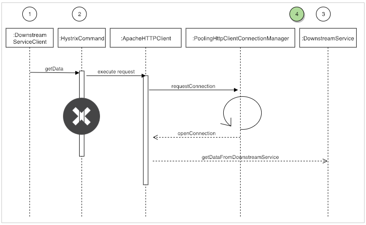
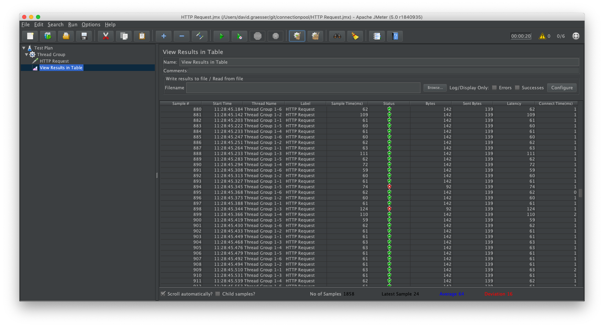

# RestTemplate - Don't trust the defaults!
## Background
During BlackFriday we had a greatly increased number of HystrixTimeoutExceptions for an essential downstream service. 
Our first assumption was that this service could not handle the high traffic and we put any responsibility for this problem into the corresponding team. 
Through Distributed Tracing we were able to correlate our outgoing requests with their incoming requests. 
We found that this service responded well below the defined timeout limit. So we started digging.

## Deep dive
At first we suspected that we had a network problem and that the time was lost somewhere along the way. 

After we could not detect any network problems we set a reverse proxy (NGINX) in front of each service to measure the
time difference between the arrival on the system and the first contact in Tomcat. 
We found out that there was an unexplainable time gap between the outgoing request and the first contact in Tomcat.

To explain this better, here is a sequence diagram and the corresponding log entries.


Each numbered point represents a measuring point / log entry. Until number 4 everything is on the main system.
4 represents the NGINX. Lets define for this example that the timeout for the downstream service is 1 second.

Log entry structure
```
Number in Sequence diagram      Timestamp       TraceId     Logmessage
```

Log entries main system
```
(1)     12:00:00:00     45FD    Call downstream service
(2)     12:00:01:00     45FD    HystrixTimeOutException Downstream service did not responded in time    
```
Log entries Downstream service
```
(3)     12:00:01:10     45FD    Incoming request
(x)     12:00:01:33     45FD    Send response back
```
Log entries NGINX on main system
```
(4)     12:00:01:05     45FD    Outgoing request to Downstream service
```

With these log entries we figured out  
(A) That the downstream system is responding really quick and far below the defined timeouts  
(B) That the time is lost inside of our system. You can see the gap between log entry 1 and 4.

## What we've learned
The origin driver for this behaviour was the weak default configuration of RestTemplate.
RestTemplate is the _old_ default HTTPClient-Wrapper within the Spring-Ecosystem. 
By default they are using the Apache HTTPClient and the connected PoolingHttpClientConnectionManager is the root cause.
The problem is that this connection manager handles by default only **2** (in words **two**) parallel connections.  
And the valid question is: _Are you kidding?_  
The fun fact is that they point to this fact in the documentation:  
> ClientConnectionPoolManager maintains a maximum limit of connection
 on a per route basis and in total. Per default this implementation will
 create no more than than 2 concurrent connections per given route
 and no more 20 connections in total. For many real-world applications
 these limits may prove too constraining, especially if they use HTTP
 as a transport protocol for their services.

This default configuration has the consequence that with a higher number of requests the requests are parked until a free connection is available again.
This parking is added to the actual request runtime and therefore a timeout may occur although the downstream service responds in time. 
In the sequence diagram, parking is symbolized by the loop icon.
 
## What you can do with this project
This project consists of a simple sprint boot application and a JMeter load test (HTTP Request.jmx) to check which pool configuration is necessary to withstand a certain load.
Initially the default configuration of RestTemplate is used. If you use the load test with 6 concurrent threads, you will get flaky timeouts.

If you change in the DownStreamService the RestTemplate-Injection from `restTemplateDefault` to `restTemplateWithPoolConfig` and 
run the load test again you will get only valid responses (response-code 200).

## Recommendation
Obvious: If you use RestTemplate, you should **always** configure the PoolingHttpClientConnectionManager corresponding to your needs.  
Even better: Use [WebClient from Spring](https://docs.spring.io/spring-boot/docs/current/reference/html/boot-features-webclient.html)  which is the _new_ default HTTPClient.
This HTTPClient is fully reactive, which means non-blocking. (No connection pool is required.)


